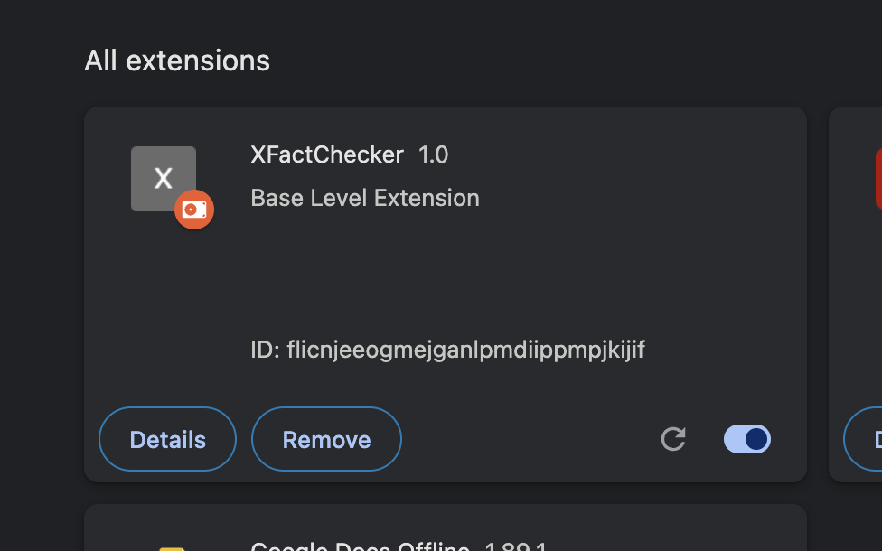
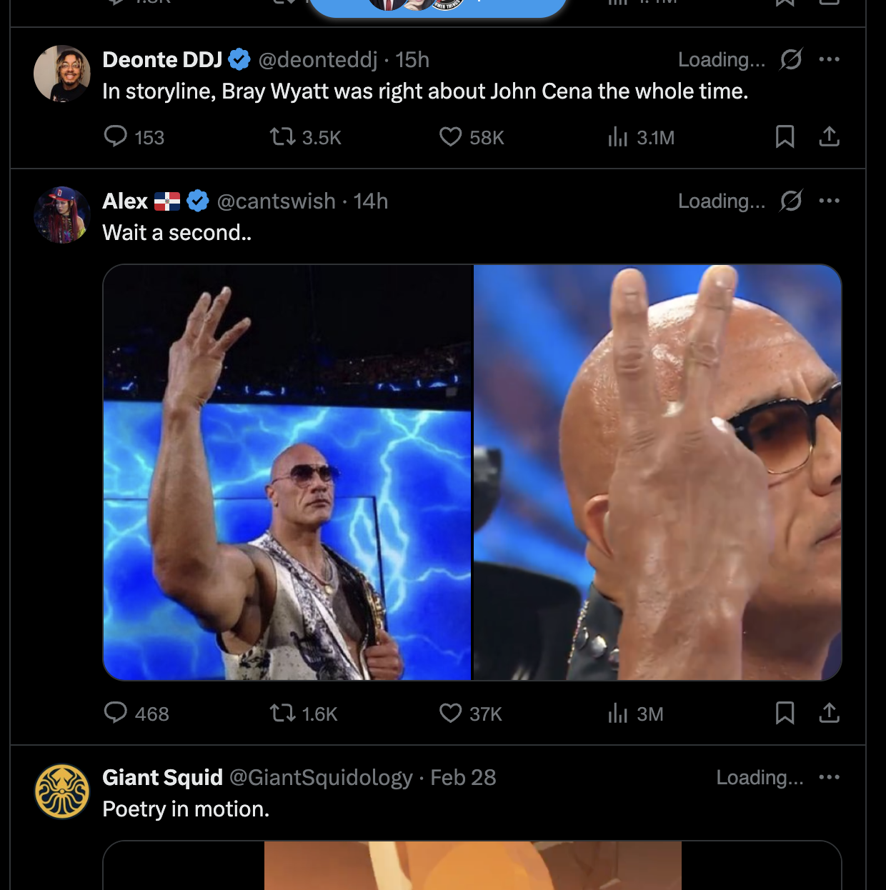
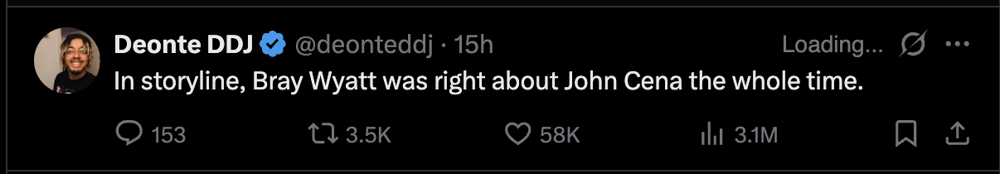
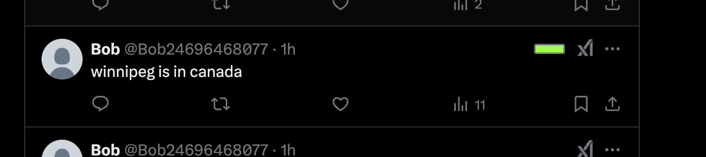
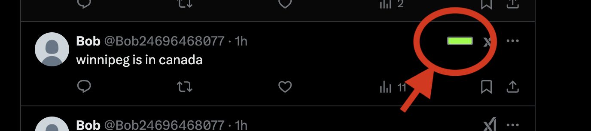
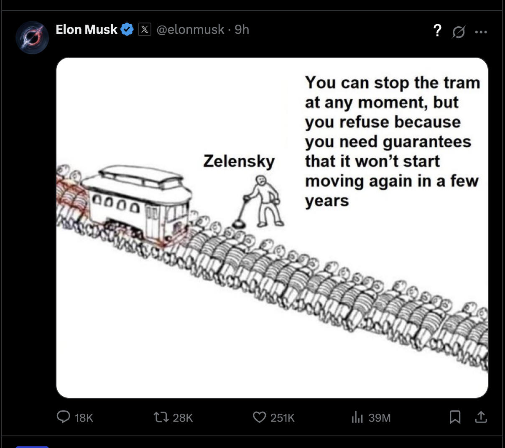

# XFactChecker – Real-Time Misinformation Detection on X (Twitter)

## Inspiration

We built this project to solve misinformation on X (formerly known as Twitter). Misinformation on social media has led to real-world consequences. From violence in Myanmar, influence on political elections, the spread of false medical information, ruined Thanksgiving dinners, etc. Our goal is to help people tell the real from the fake.

## What it does

XFactChecker is a Chrome extension that reads tweets in real-time and indicates to the user how true tweets are. It gives an evaluation bar and a percentage scoring of how true that post is.

### XFactChecker Chrome Extension

### Loading fact checking result

### Displaying a fact-check score on a tweet, and it is true

### A controversial tweet can't be fact checked

## How we built it

The extension is built using JavaScript, HTML, and CSS. The client side makes a call to our backend service which runs a FastAPI server for speed. The FastAPI server in turn makes requests to OpenRouter which is the online service we use to make prompts to LLM models. In particular, we use the llama-3.3 model which we found to be the most accurate.

## Challenges we ran into

- We had problems distinguishing between artistic, comedic, opinions and facts.
- False positives vs False Negatives

## Accomplishments that we're proud of

- Nam is a first-year student and this is his first hackathon but he took responsibility and made immense contributions to our project.
- Nicholas was in charge of the client-side code and supported Nam all the way.
- Tega showed great leadership skills.

## What we learned

- Solving misinformation is a difficult problem.
- There is a great need for this technology.
- This is a solvable problem.
- We learnt a lot of new client and server-side tricks.